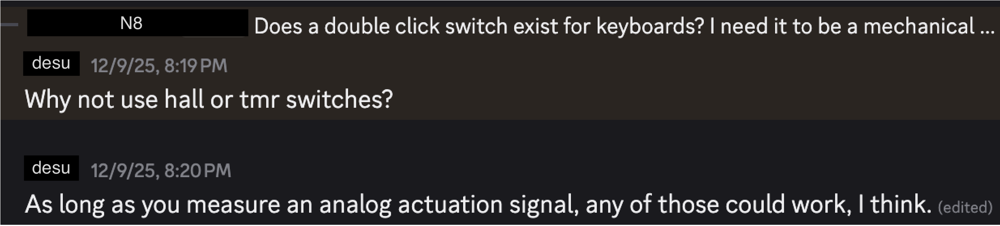
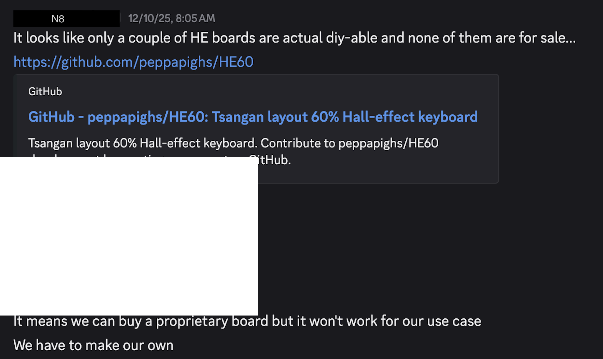
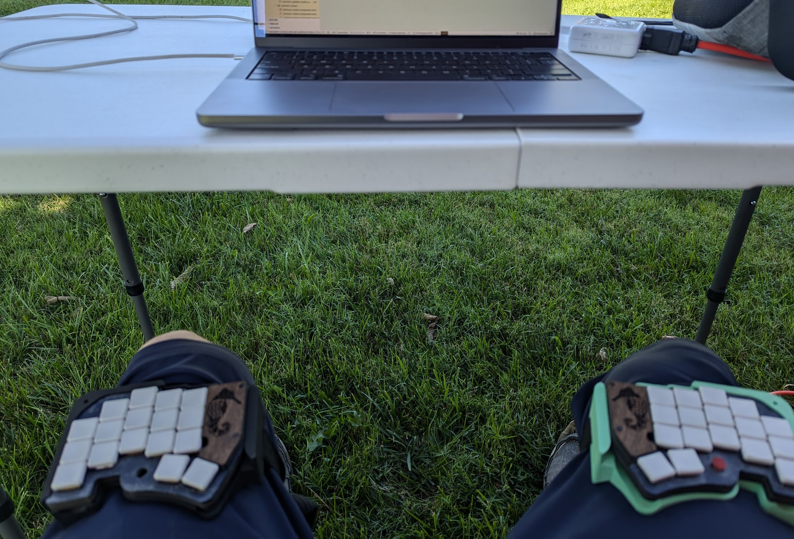
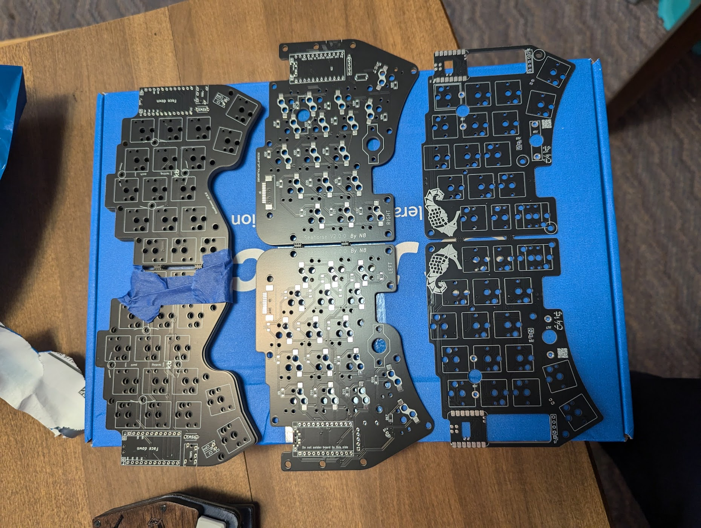
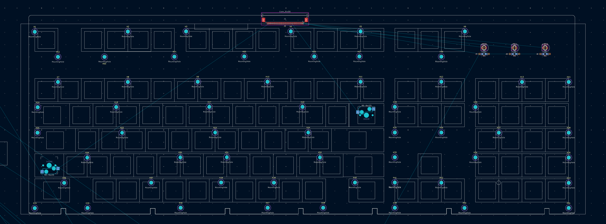
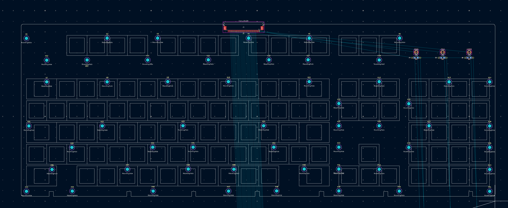
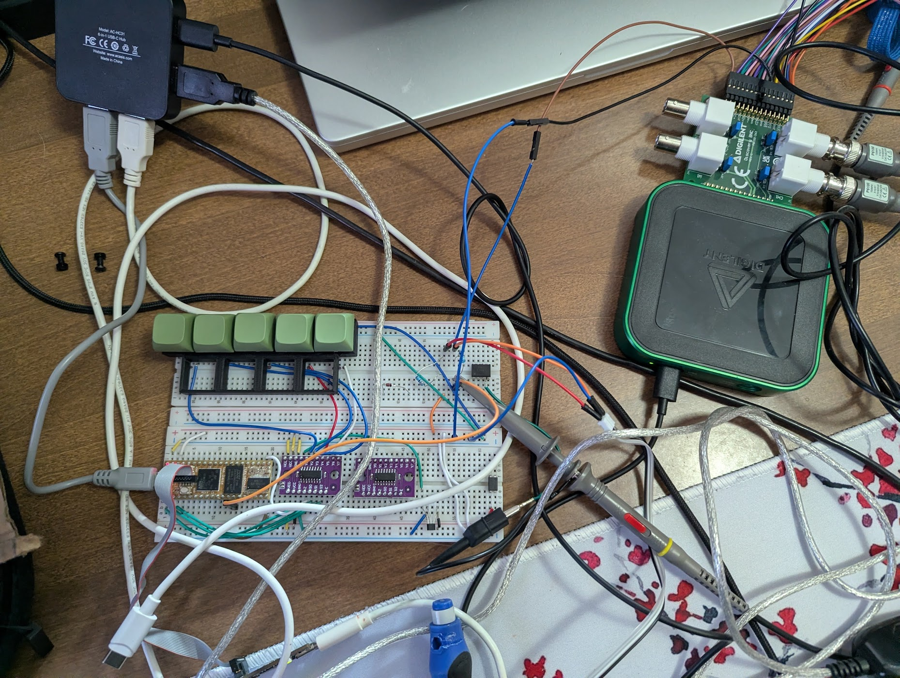

Initial Velocity research 

Figure out if the idea is actually possible by asking questions in the ZMK discord

Do market research to see if we can actually make the keyboard with minimal effort, find out that we cannot buy anything that will work for our use case

Find another project that does what we want, two actuation points for velocity measure. This is the melodicate instrument which actually sparks the idea to do wikihayden

https://www.koopinstruments.com/instrument-projects/melodicade-mx

It becomes clear that stacking two switches on top like the melodicade won't work for a keyboard keyboard, it's too thick.

sadness and depression insue

But we trudge on 

Scouring the internet I come across the Model M keyboard, which is a perfect fit for our use case, in that it looks cool and if I am going to make a keyboard from scratch is has to be that one. Which i later find out made the project an order of a magnitude harder than expected.

with the keyboard design decided I now have to start on the pcb. it's a big keyboard and it's going to be a lot of work. measuring and designing and so on

but then I find https://github.com/dcpedit/mod-mmm
which is a pcb built for the Ibm model m, someone else has done most of the work

so now I just have to adapt it to my use case, which means i need to make a mechanical keyboard work with hall effects 

but earlier we found an open source keyboard https://github.com/peppapighs/HE60/tree/main

so I do what any good developer does, I take my sources of information and I copy them, but change them enough so that the teacher doesn't notice 

using the two designs I use the mod-mmm pcb as a starting point and the HE60 keyboard as a reference for electrical components

I've made keyboards before like my custom split keyboard the seahorse 

which has had at least 3 itterations 

but never a full sized board, that was hall effect as well.

layout more keys instead of the spacebar

keyboard optimized for wikihayden

But first lets make sure it works 

