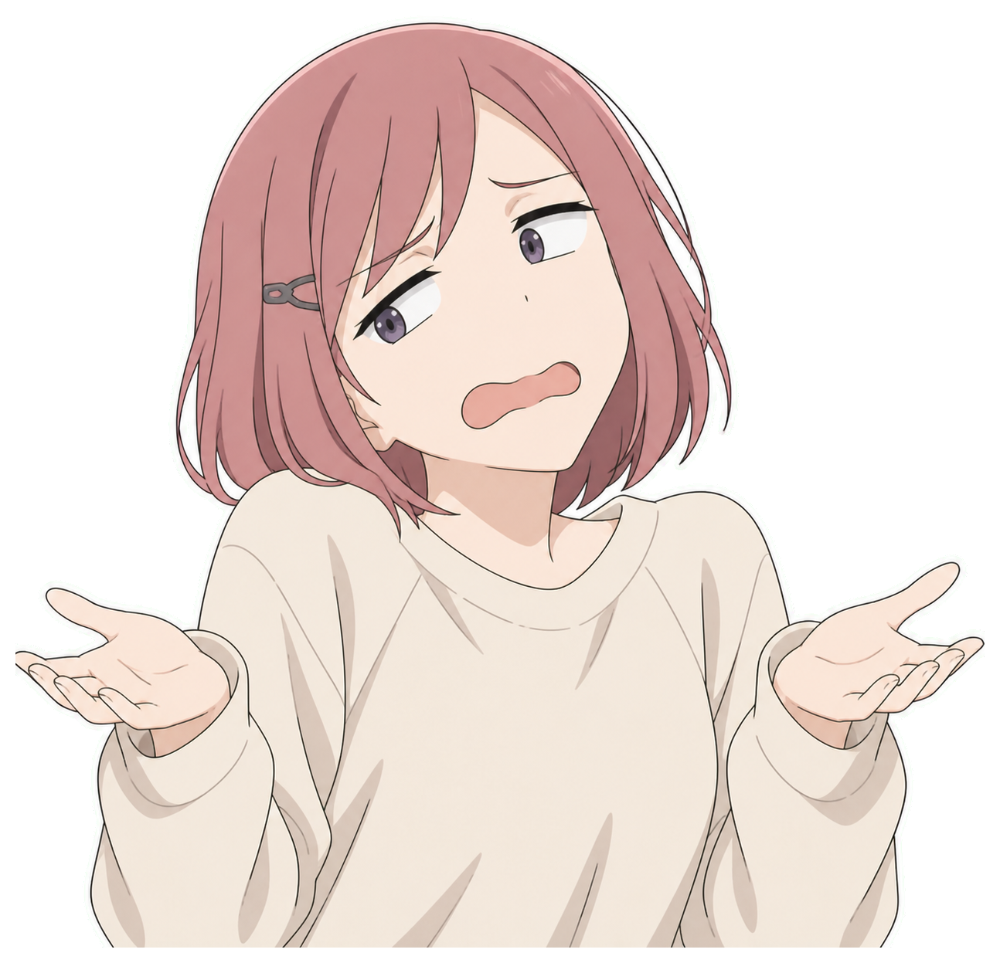
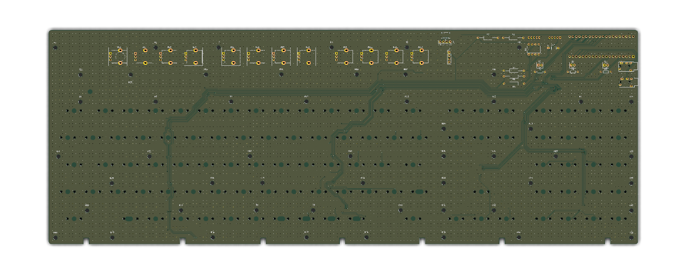
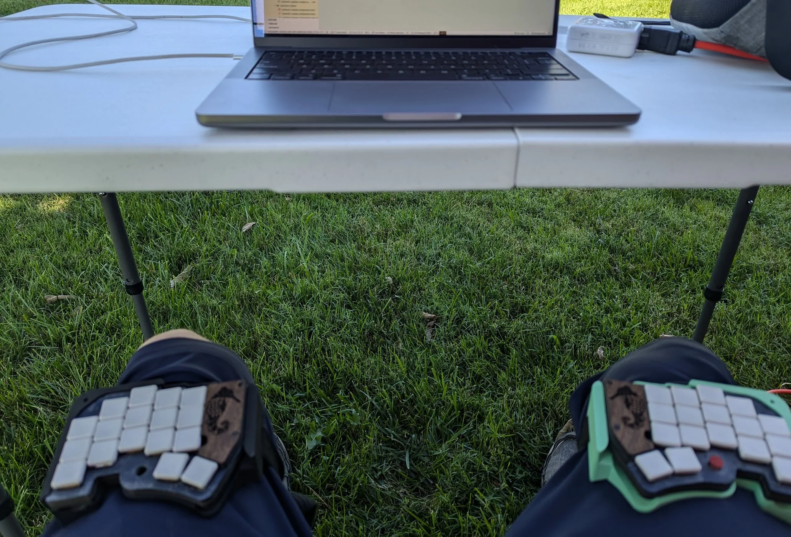

# Anime storyboard component kit

Open [`storyboard-library.html`](storyboard-library.html) through the local deck server for the visual catalog. The reusable implementation lives in [`anime-storyboard.css`](anime-storyboard.css) and is imported by `styles.css`, so every existing slide can use it.

The bubble API is documented separately in [`MANGA_BUBBLES.md`](MANGA_BUBBLES.md).

## Authoring sequence

Choose components in this order:

1. **Beat:** What changes for the audience during this slide?
2. **Shot:** What should visually dominate that change?
3. **Blocking:** Where do the actor, artifact, and evidence sit?
4. **Dialogue:** Speech, thought, shout, whisper, system voice, or narration?
5. **Emotion:** Which single backdrop reinforces the beat?
6. **Timing:** What is visible initially, and what appears on each click?

This keeps anime styling attached to the story rather than added as decoration afterward.

## Basic stage

```html
<div class="as-stage as-stage--cyan as-shot--two">
  <div class="as-fx as-fx--screentone"></div>
  
  
</div>
```

`as-stage` owns the frame and clipping. Actors, props, effects, bubbles, and captions remain separate children so any piece can be replaced independently.

## Shot recipes

| Class | Narrative purpose |
| --- | --- |
| `as-shot--establishing` | Introduce a setting, artifact, or new chapter |
| `as-shot--two` | Dialogue, agreement, or disagreement |
| `as-shot--closeup` | Realization, confession, or central thesis |
| `as-shot--reaction` | Punch line, panic, triumph, or defeat |
| `as-shot--over-shoulder` | Inspect hardware, code, evidence, or a clue through a cropped foreground observer |
| `as-shot--split` | Contrast two perspectives or systems |
| `as-shot--montage` | Iteration, research, debugging, or elapsed time |
| `as-shot--cliffhanger` | End an arc with an unresolved question |
| `as-shot--insert` | Make an object, control, or clue dominate the frame |
| `as-shot--extreme-closeup` | Show an emotional peak, tiny tell, or decisive detail |
| `as-shot--low-angle` | Give a character authority, victory, or threat |
| `as-shot--high-angle` | Create vulnerability, isolation, defeat, or scale |
| `as-shot--dutch` | Signal instability, panic, surprise, or broken rules |
| `as-shot--three` | Stage a decision, triangle, team beat, or social pressure |
| `as-shot--foreground-frame` | Establish POV, surveillance, tension, or directed attention |
| `as-shot--reveal` | Introduce an identity, stakeholder, system, or transformation |

Inside a recipe, semantic roles receive the standard blocking for that shot:

- `as-actor--lead`: owns the decision or visual beat
- `as-actor--support`: supports or reacts to the lead
- `as-actor--third`: completes a three-character composition
- `as-actor--frame`: occupies the near foreground and establishes viewpoint
- `as-prop--lead`: the object or evidence the audience should inspect

These roles describe story function, not character identity. You can swap the cast without rebuilding the composition.

## Actor modifiers

Position:

- `as-actor--left`, `as-actor--center`, `as-actor--right`
- `as-actor--off-left`, `as-actor--off-right`

Depth and crop:

- `as-actor--foreground`, `as-actor--midground`, `as-actor--background`
- `as-actor--bust`, `as-actor--closeup`

Direction and treatment:

- `as-actor--look-left`, `as-actor--look-right`
- `as-actor--tilt-left`, `as-actor--tilt-right`
- `as-actor--silhouette`, `as-actor--memory`
- `as-actor--enter-left`, `as-actor--enter-right`

For `as-shot--foreground-frame`, add `as-frame--right` to the stage to mirror the default foreground framing:

```html
<div class="as-stage as-shot--foreground-frame as-frame--right">
  
  
</div>
```

The catalog's actor cutouts are already transparent. Do not place portraits into new card images; keep the character and surrounding composition independently editable.

## Prop modifiers

Use `as-prop` for hardware, cards, screenshots, and important evidence:

- `as-prop--left`, `as-prop--right`
- `as-prop--small`, `as-prop--large`
- `as-prop--silhouette` for object and system reveals
- `as-prop--lead` inside establishing and over-the-shoulder recipes

If a shot needs exceptional placement, override component variables locally instead of adding a one-slide class:

```html

```

## Emotion effects

Effects are empty, text-free elements layered inside the stage:

```html
<div class="as-fx as-fx--rings"></div>
```

| Class | Meaning |
| --- | --- |
| `as-fx--rays` | Confidence, success, or importance |
| `as-fx--rings` | Realization or discovery |
| `as-fx--speed` | Urgency or rapid progress |
| `as-fx--dread` | Pressure or approaching trouble |
| `as-fx--defeat` | Collapse, exhaustion, or failure |
| `as-fx--sparkles` | Delight, magic, or admiration |
| `as-fx--fury` | Anger or uncontrolled escalation |
| `as-fx--memory` | Flashback or softened recollection |
| `as-fx--screentone` | Neutral manga texture |
| `as-fx--silence` | Awkward pause; add `data-mark="・・・"` |
| `as-fx--blush` | Embarrassment or flustered attention |
| `as-fx--shock` | Alarm, impact, or a sudden revelation |
| `as-fx--romance` | Affection, infatuation, or admiration |
| `as-fx--comedy` | Playful chaos or a light punch line |
| `as-fx--tension` | Confrontation or competing positions |
| `as-fx--celebration` | Victory, payoff, or a milestone |
| `as-fx--gloom` | Despair, shame, or sinking morale |
| `as-fx--focus` | Determination or precision |
| `as-fx--dream` | Reverie, fantasy, or an imagined outcome |
| `as-fx--confusion` | Uncertainty or tangled reasoning |
| `as-fx--isolation` | Loneliness, exposure, or emotional distance |
| `as-fx--anxiety` | Nervousness, social pressure, or rising panic |
| `as-fx--freeze` | Frozen disbelief or an abrupt emotional stop |
| `as-fx--warmth` | Comfort, relief, or emotional safety |
| `as-fx--suspense` | Unease, danger, or an unresolved threat |

Use one primary emotional effect per scene. Multiple simultaneous effects weaken the visual vocabulary.

## Story information components

- `as-location-card`: location and time establishing card
- `as-story-caption`: narrator or editorial caption
- `as-freeze-label`: character or concept freeze-frame label
- `as-cut-in`: full-width dramatic statement
- `as-dialogue-cameo`: independent actor-and-bubble grouping for recurring side commentary
- `as-eyecatch`: chapter break or intermission card
- `as-beat-tag`: compact recap, time-jump, status, or preview label

Keep the cameo wrapper separate from both pieces so it can be staged as one Reveal fragment:

```html
<div class="as-dialogue-cameo fragment step-pop">
  
  <div class="as-dialogue-cameo__bubble mb mb--speech mb--tail-r mb--yellow mb--sm">
    <div class="mb__body"><span class="mb__name">Kaori</span><p class="mb__text">Which checkbox is the boss fight?</p></div>
  </div>
</div>
```

## Montage panels

```html
<div class="as-stage as-shot--montage">
  <figure class="as-panel">
    
    <figcaption class="as-panel__label">Prototype</figcaption>
  </figure>
  <figure class="as-panel">...</figure>
  <figure class="as-panel">...</figure>
</div>
```

Three panels are the default. If the sequence needs more than four distinct images, use multiple slides so each beat remains readable.

## Live deck examples

The component vocabulary is used directly in the presentation rather than only in the catalog:

- Slide 11 uses `as-shot--insert` for the Model M artifact introduction.
- Slide 23 uses `as-shot--over-shoulder` to inspect the real KiCad copper export.
- Slide 42 uses `as-shot--high-angle` for the debugging defeat punch line.
- Slide 43 uses `as-shot--reveal` and `as-prop--silhouette` for the returning Synth Phone.

Existing custom manga scenes also carry `data-beat`, `data-shot`, and `data-emotion` metadata so their narrative function remains searchable without forcing them into a generic layout.

## Reveal timing

All components work with the deck's existing fragment system:

```html
<div class="as-fx as-fx--rings fragment step-wipe"></div>

<div class="mb mb--speech mb--cyan fragment step-punch">...</div>
```

For repeated children, prefer the existing declarative stagger API:

```html
<div class="as-stage as-shot--montage"
     data-stagger=".as-panel"
     data-stagger-effect="step-wipe">
  ...
</div>
```

## Storyboard metadata

Optional data attributes make the slide's purpose searchable without changing rendering:

```html
<section
  class="slide layout-content"
  data-beat="realization"
  data-shot="closeup"
  data-emotion="insight"
  data-transition="firmware implementation"
>
```

Recommended beat names include `setup`, `question`, `failure`, `discovery`, `realization`, `decision`, `implementation`, `proof`, `victory`, and `cliffhanger`.

## Choosing expression intensity

- **Base:** ordinary explanation and supporting reactions
- **Big:** major slide beat or presentation-scale dialogue
- **Max:** punch line, arc climax, or one deliberately exaggerated reaction

A reaction sequence should escalate or de-escalate intentionally. Avoid choosing `max` merely because it fills more space.

## Asset provenance

The catalog exposes every current asset path. Items marked **reuse check** or **mixed** must be reviewed against the provenance section in `README.md` before public redistribution. The recurring Mio, Ren, and Kaori face libraries are original project artwork.
